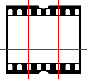
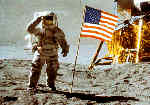
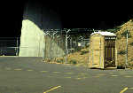
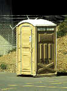

# KURZE, INFORMATIVE FOTOGRAFIE-TIPS 

Dieser Text behandelt einige wichtige Grundfragen zur Fotografie. Klicken Sie einfach auf ein Themengebiet, welches Sie interessiert! Sie können den ganzen Text lesen, indem Sie ihn von hier bis zum Schluss durchblättern.

1. [Portrait](#Portrait)
1. [Landschaft](#Landschaft)
1. [Gesellschaftsanlass](#Gesellschaftsanlass)
1. [Konzert](#Konzert)
1. [Kirchen](#Kirchen)
1. [Goldener Schnitt](#Goldener-Schnitt)
1. [Filme](#Filme)
1. [Blitzen](#Blitzen)
1. [Filter](#Filter)
1. [Technische Infos](#echnische-Infos)
1. [Reisefotografie](#Reisefotografie)
1. [Kommentar an den Autor](#Kommentar-an-den-Autor)

## PORTRAIT
Die Standardbrennweite für Portraits beträgt so zwischen 70 und 100 oder auch je nach Situation mehr. Kompaktkameras ohne Zoom haben kurze Brennweiten zwischen 32 und 38mm und sind daher zum Portraitieren meist nicht gerade geeignet. Portraits mit solchen Kameras sollten daher aus einer gewissen Entfernung geschossen werden, so dass der ganze Körper der Person abgebildet ist. Vor allem auch, weil die Nahdistanz meist etwa einen Meter oder mehr beträgt.

Mit SLR-Kameras sind sehr schöne Portraits möglich. Dabei ist vor allem auf eine grosse Blendenöffnung zu achten, damit der Hintergrund unscharf wird und das Gesicht "freigestellt" wird. Das Automatikprogramm wird dabei des öfteren blitzen. Das kann bei Gegenlicht oder starkem Seitenlicht hilfreich sein. Als Portraitfilme eignen sich im besonderen Agfa, Migros(Agfa) oder Fuij.

Ich habe auch gute Erfahrung bei Portraits mit kurzen Brennweiten gemacht. Dabei ist vor allem darauf zu achten, dass die ganze Person auf dem Bild ist und die Kamera sich auf der Augenhöhe des Gegenübers befindet. Diese Portraits geben eine erfrischende Nähe und wirken ein wenig karikativ. -)Ausprobieren.

## LANDSCHAFT
Ich mag dabei vor allem Kodak-Filme. Sie sind eher harte Filme mit einem guten Kontrast, das wirkt dem Dunst entgegen. Ausserdem hat er eine kräftige Farbwiedergabe. In der Landschaftsfotografie ist alles erlaubt, was gute Bilder ergibt. Ich benutze dabei oft ganz bis mittelkurze Brennweiten vom 24mm bis 35mm. Im GEO findet man aber des oft geniale Landschaftsbilder mit langen bis sehr langen Brennweiten, welche die Landschaft in scheinbar nur 2 Dimensionen zusammenfassen.

## GESELLSCHAFTSANLASS
Dabei ist ein Blitz unumgänglich, da oft im inneren fotografiert werden muss. Hohe Filmempfindlichkeiten sind sehr hilfreich. ISO 400 ist ein üblicher Wert, den auch die einfachste "Kleinbildknipse" noch verträgt. Für eventuelle Aussenaufnahmen ist aber ein Agfa 100er eine gute Wahl. Darauf achten, dass man von jeder Person eine Aufnahme hat, wo sie drauf ist. Falls ein Profifotograf dabei ist, kann es hilfreich sein sich ein wenig in seiner Nähe aufzuhalten. Eventuell kommt man ins Gespräch oder ist da wo es "heiss" ist. (Gratulationen, K&uum;sschen, Geschenke, Ansprachen, Handschläge, Unterzeichnungen, Übergaben). Solche "wichtigen" Ereignisse sollte man nicht verpassen. Auch einige Personen, die einem besonders auffallen, können fotografiert werden. Keine für jemanden peinlichen Fotos!.

## KONZERT
Mit Kompaktkameras verwendet man am besten einen 400er und blitzt. Allerdings wird dadurch die Konzertatmosphäre zerstört. Eventuell Kamera einfach hochhalten und knipsen.

Für SLR's gilt folgendes: Unbedingt einen Film mit sehr hoher Empfindlichkeit verwenden. Um ISO 1000 oder noch mehr sind gut. Diese Filme haben zwar eine nicht so tolle Farbwiedergabe, dafür werden Verschlusszeiten erreicht, die eine nicht verwackelte Foto ohne Blitz ermöglichen. Es gibt nichts hässlicheres als verwackelte Fotos.

Kurze Brennweiten ergeben auch hier den Eindruck rälicher Nähe, wenn man in der Lage ist, mit der Kamera genug nah an den Bühnenrand heranzugehen. Der Star wirkt "zum Anfassen". Lange Brennweiten vermitteln eine gewissen "Respekt" oder Unnahbarkeit. Ein schneller Autofokus ist ein unbestreitbarer Vorteil. Lichtstarke Objektive mitnehmen! Das 100-300 f/4.5-5.6 kannst du zu Hause lassen.

Mit dem Stativ ist das so eine Sache. Wenn du an der Fuer im Saal nicht teilnehmen willst, so ist es sicher von Vorteil es dabeizuhaben. Besonders Aufnahmen mit Teleobjektiv sind so "sicherer". Wenn du aber "mitpowgen" willst, nimm es nicht mit. In der Menschenmasse ist es nur hinderlich oder du handelst dir sogar Ärger ein.

## KIRCHEN
Unbedingt ein Stativ mitnehmen und einen feinkörnigen, scharfen Film. z.B. Kodachrome 64. Blitzen ist oft nicht erlaubt, aber für das gute Foto braucht man auch keinen. Suche nach interessanten Perspektiven. Von unten nach oben oder einer Mauer entlang oder oder oder. Mit der Zeit entwickelt man eine eigenen Stil! Die meisten guten Kirchenfotografien sind aus ungewühnlichen Perspektiven aufgenommen. Meist soll möglichst alles scharf abgebildet sein. Dazu peilt man einen Punkt in mittlerer Entfernung an und fokussiert. Dann blendet man am besten auf f/11 oder f/16 ab. Eventuell mit Selbstauslöser fotografieren, um Verwackelungen durch das Drücken des Auslösers zu vermeiden.

## GOLDENER SCHNITT
Es wirkt meist besonders vorteilhaft, wenn das Hauptmotiv des Bildes nicht genau in der Mitte des Bildes plaziert wird. Auch Maler und andere grafische Künstler wenden das Prinzip des goldenen Schnittes an. Die untenstehende Grafik zeigt die Goldenen Linien und die vier Schnittpunkte. Eine mögliche Anwendung dieses Prinzips zeigt die danebenstehende Fotografie.

_Darstellung des "Goldenen Schnittes"_

_Der Körper des Astronauten befindet sich auf der linken Goldenen Linie, der Kopf und die Füsse auf zwei Schnittpunkten._

Der Goldene Schnitt teilt die Seiten im Verhältnis von ca. 3:8. Es sollte zudem beachtet werden dass die abgebildete Person nicht zum Bild hinausschaut. In Blickrichtung sollte noch etwas "Raum" auf der Fotografie vorhanden sein. Würde also die Person nach rechts schauen, so sollte sie in der linken Bildhälfte abgebildet sein.

## FILME
Ich möchte ausdrücklich darauf hinweisen, dass die hier gemachten Angaben über die Diafilme und deren Eignung für bestimmte Zwecke meine persönlichen Eindrücke sind.

Die Eigenschaften der verschiedenen Filme lassen sich grob nach Marken einordnen. Die Aussagen im ganzen Text beziehen sich, sofern nicht anders angegeben, auf Diafilme, dürften aber auch auf Farbnegativfilm übertragbar sein.

- **Agfa CTX**  
Er ist weich, hat einen eher schwachen Kontrast. Er eignet sich für Portraitfotografie. Die Migros-Diafilme sind Agfa. Hat eher einen leichten Grünstich. 
- **Fujichrome Sensia**  
Er ist ein gutes Mittelding, guter Kontrast. Hat einen eher violetten Grundton. 
- **Fujichrome G 1600**  
Recht scharf, doch in den Farben zum Teil etwas zweifelhaft. 
- **Kodachrome**  
 Extrem scharfer Film, extrem guter Kontrast, hart, starke Farben. Er ist etwas für angefressene Schärfefanatiker. Er ist "der" Film für Objektivtests. Etwas kalte, bläuliche Farbwiedergabe. Er kann nur von Kodak entwickelt werden, weil er eine speziellen Prozess braucht. (nicht E6). 
- **Kodachrome Elite**  
"Der Kommerz-Kodachrome fürs Volk". Etwas wärmere Farbwiedergabe und nicht ganz so extrem wie der Kodachrome. 

## BLITZEN
Allzu kurze Brennweiten (35mm und darunter) sind nach Möglichkeit zu vermeiden. Viele Blitze können dann nicht mehr voll die Bildecken ausleuchten. Auch wird die Gefahr grösser, dass die Gegenstände im Vordergrund zu hell und diejenigen im Hintergrund zu dunkel abgebildet werden. Vorsicht mit grossen, voluminösen Objektiven. Sie können im Bild Schatten verursachen, besonders, wenn der Blitz sich nahe bei der Objektivachse befindet. Sonnenblenden aus dem gleichen Grund abnehmen.

Ein wichtiger Punkt beim Blitzen ist die Haltung der Kamera. Sie soll so gehalten werden, dass die fotografierte Person nicht ein Schatten "vor dem Gesicht" hat. Um dies zu vermeiden, muss man eventuell die Kamera auf den "Kopf gestellt" halten. Beispiel: wenn die Person nach links schaut, so soll der Blitz sich links von der Objektivachse befinden.

Ich persönlich bin nicht ein Freund des Blitzens. Die Blitzsteureung muss der Automatik anvertraut werden, wenn man nicht eine extrem grosse Erfahrung hat. Dies ist immer problematisch, weil man keine Kontrolle hat. Ausserdem zerstört ein Blitzlicht die Stimmung vom vorhandenen Licht.

## FILTER
Die meistgebrauchten Filter sind Farbfilter. Sie verändern die "Farbe" des Bildes. Das meistgebrauchte Farbfilter ist das 80B Blaufilter. Es wird benötigt, um den Gelb-Orange-Farbstich auf Innenaufnahmen bei Kunstlicht zu mindern. Normale Glühbirnen geben ein sehr "warmes", dh. gelbliches, Licht ab. Dieser Filter korrigiert das Licht so, dass es dem normalen Tageslicht näher kommt. UV-Röhren und manche Energiesparlampen geben hingegen einen Grünstich. Dagegen hilft ein Violettfilter an. Farbfilter aller möglichen Farben finden in der Schwarzweissfotografie Anwendung. Sie verändern die Kontraste bestimmter Farben auf dem Schwarzweissfilm.

Ebenfalls recht häufig gebraucht wird ein Pol-Filter (Polarisationsfilter). Es hilft die Kontraste und die Farben bei Aussenaufnahmen im Sonnenlicht zu verbessern. Auch Dunst kann in gewissen Grenzen zum Verschwinden gebracht werden. Vor allem aber vermindert es in starkem Masse Reflexionen auf nichtmetallischen Oberflächen wie zum Beispiel Glas oder Wasser.

Seltener zur Anwendung kommen sogenannte Effektfilter, z.B. Lochfilter, Sternchenfilter, Weichzeichner etc.

## TECHNISCHE INFOS
Jede Kamera braucht eine gewisse Zeit vom Drücken des Auslösers bis zur Belichtung. Bei einer SLR muss vor dem Belichten zuerst der Spiegel hochgeklappt und die Blende eingestellt werden. Erst dann kann der Verschlussvorhang ablaufen. Bei meiner NIKON F301 dauert es vom Auslösen bis zur Belichtung 114 Millisekunden bei schneller Bildfolge oder 185 Millisekunden bei langsamer Bildfolge.

## REISEFOTOGRAFIE
"Kleinbild-Teleskop-Antennen" sind ziemlich praktisch, doch die Bildqualität ist meist nicht über alle Zweifel erhaben, besonders in punkto Schärfe. Falls man nicht gerade Posters anfertigen lassen will, geht es aber gut. Ein Problem ist aber auch die oft grosse Nahdistanz oder das Distanzgefummel in der "Makroeinstellung". Ausserdem sind diese Kameras nicht besonders lichtstark. (f/8 oder so)

Mit einer SLR auf Reisen ist man mit einem oder zwei Zooms am besten beraten. Wegen dem geringeren Platzbedarf und Gewicht tun's auch weniger lichtstarke Objektive. Mit einem Zoom ist man einfach flexibler. Es ist ärgerlich, ein Bild nicht machen zu können, nur weil man nicht gerade das richtige Objektiv draufhatte. Genug Zeit fürs fotografieren einplanen. Das gute Foto braucht oft Zeit.

Ich bin erstaunt, was man mit einer SLR und einem 28erli (28mm Objektiv) alles anstellen kann. Viele gute Israelfotos sind mit diesem Objektiv gemacht worden. Viele Perspektiven muss man mit der vors Auge gehaltenen Kameras aufspüren. Aufmerksam durch die Welt latschen öffnet einem die Augen für so manches Motiv . Viele Varianten ausprobieren. Wie viele Filme soll ich mitnehmen? Die doppelte Menge wie man geplant hat. (kein Scherz!!!)

## FACHBEGRIFFE ERKLÄRT

- **Autofokus (AF)**  
Automatische Scharfstell-Funktion; hat heutzutage fast jede Kamera. 
- **Belichtung**  
Ein gutes Bild soll eine angenehme Belichtung aufweisen, die die Realität möglichst exakt wiedergibt. Die Belichtungsautomatik geht davon aus, dass das Sujet 19% des vorhandenen Lichts reflektiert. Dies ist aber nur ein Durchschnittswert. Wenn das Sujet viel weisse Flächen enthält, wie zum Beispiel eine Hausfassade oder eine Statue aus weissem Stein, so scheint sie auf dem fertigen Foto gräulich, weil die Belichtungsautomatik so belichtet hat, wie wenn nur 19% des Lichtes reflektiert wurden. In unserem Fall war es aber mehr. In diesen Fällen muss der Fotograf eingreifen und das Bild quasi etwas überbelichten, damit das Bild auch so aussieht, wie der er das Sujet gesehen hat. Umgekehrt muss der Fotograf bei viel dunkler Fläche leicht unterbelichten.
Als Belichtung wird auch der Moment bezeichnet, in dem das Licht auf den Film fallen kann, also der Verschluss geöffnet ist. 
- **Bildfolge**  
Gesamtbezeichnung für mehrere aufeinanderfolgende Belichtungen. 
- **Bildfrequenz**  
Wie viele Bilder in der Sekunde gemacht werden. Eine Bildfrequenz von 3 B/s bedeutet, dass 3 Bilder in der Sekunde belichtet werden. Zwischen den Belichtungen muss natürlich immer der Film transportiert werden. 
- **Brennweite**  
Ein Mass dafür, wie gross der Bildwinkel ist. Oder, anders gesagt, wie nahe die Gegenstände durch den Sucher auf dem Bild erscheinen. Ein Bild mit einer langen Brennweite wirkt wie mit einem Feldstecher, ein mit einer kurzen Brennweite aufgenommenes dagegen wirkt eher wie wenn man weit entfernt stehen würde (wenn sie vom gleichen Standpunkt aus aufgenommen werden.). Die beiden Fotos unten zeigen dies deutlich. Sie sind beide vom genau gleichen Standpunkt aus aufgenommen.  
  
_Ansicht mit kuzer Brennweite (Weitwinkel-Objektiv)_  
  
_Ansicht mir langer Brennweite (Tele-Objektiv)_  
Sollte hingegen ein Gegenstand immer gleich gross abgebildet werden, so müsste man mit einem Weitwinkelobjektiv nahe herantreten, mit einem Teleobjektiv aber einen grösseren Abstand halten. 
- **Blende**  
Die Blende ist vergleichbar mit der Iris des Auges. Sie reguliert die pro Sekunde einfallende Lichtmenge. Eine grosse Zahl z.B. 22 bedeutet, dass die Blende stark geschlossen ist. Eine kleine Zahl z.B. 2.8 bedeutet, dass sie weit offen ist. 
- **Filmempfindlichkeit**  
Sie sagt, wie gross dass die Lichtmenge sein muss, damit der Film korrekt belichtet wird. Sie wird in ISO angegeben. Ein Film mit der Empfindlichkeit ISO 100 hat eine um viermal geringere Empfindlichkeit als ein Film mit ISO 400. Bei der gleichen Blendeneinstellung muss der 400er also nur ein Viertel so lang belichtet werden wie ein 100er. 
- **Fischauge**  
Ein Fischaugenobjektiv erzeugt Bilder, die zu den Ecken hin gekrümmt erscheinen. Dies ergibt einen etwas bizarren Effekt, der Fischaugeneffekt genannt wird. Dieser Effekt kommt jedoch nur bei extrem kurzen Brennweiten zum Tragen. 
- **Kleinbild(film)**  
Bezeichnung für das gebräuchlichste Filmformat. Das Negativbild ist 24mm x 36mm gross. Die Filmdosen tragen die Aufschrift 135. Es gibt auch grössere Filmformate, zum Beispiel das Mittelformat. Der Vorteil eines grösseren Negativs ist die schärfere Wiedergabe. Es bringt aber grössere und damit schwerere Kameras und Objektive mit sich. 
- **Gegenlicht**  
Als Gegenlicht wird Licht bezeichnet, das direkt von vorne, also gegen die Kamera kommt, zum Beispiel, wenn eine Person gegen die Sonne fotografiert wird. 
- **Kompaktkameras**  
Kleine Kameras, die alles Benötigte schon dabeihaben und nicht ausbaufähig sind. Also die Kameras der meisten "Öppedie"-Fotografen. Es zum Teil recht erstaunlich, was die Kleinen alles für Schikanen intus haben. Doch die Bildqualität reicht natürlich nicht an eine gute SLR heran. 
- **Lichtstärke**  
Die Lichtstärke bezeichnet die kleinstmögliche Blendenzahl, also wie viel Licht das Objektiv maximal auf den Film bringt. Es ist ein wichtiges Kriterium bei der Objektivwahl. Je kleiner die Zahl, um so besser. Die Lichtstärke wird oft in der Form f/x angegeben, wobei x die Lichtstärke bezeichnet. 
- **Makro**  
Makrofotografie bedeutet das Fotografieren von kleinen Objekten. Viele Kompaktzoomkameras haben eine so bezeichnete Funktion, bei der man näher als sonst an den Gegenstand herantreten kann. Aber echtes Makro ist, wenn man eine etwas grössere Briefmarke in voller Grösse abbilden kann. Alles andere darf man als Nahaufnahme bezeichnen. 
- **Nahdistanz**  
Bezeichnet die minimale Distanz, die man mit der Kamera an das Motiv herantreten kann, ohne dass das Bild unscharf wird. 
- **Normalobjektiv**  
Dieses hat eine Brennweite die in etwa dem Sichtwinkel des menschlichen Auges entspricht. Das ist etwa 50mm. 
- **Objektivachse**  
Die verlängerte Linie der Objektivmitte. 
- **Schärfentiefe**  
Sie bezeichnet die Differenz der minimalen zur maximalen Distanz, wo noch scharf abgebildet wird. Als "Scharf" wird alles bezeichnet, was auf dem normalen Kleinbildformat kleinere Punkte als 1/30mm erzeugt. Je stärker abgeblendet wird, also je grösser die Blendenzahl, um so grösser wird die Schärfentiefe. 
- **Seitenlicht**  
Als Seitenlicht wird das Licht bezeichnet, welches von der Seite ins Bild fällt. 
- **Selbstauslöser**  
10 Sekunden nach dem Drücken der Selbstauslösertaste wird das Bild aufgenommen. Praktisch, für Gruppenfotos oder wenn die Kamera auf etwas wackeligem Untergrund abgestellt wird, um Verwackelungen zu vermeiden. 
- **SLR**  
SpiegelReflexKamera. Diese Kameras besitzen auswechselbare Objektive. Sie sind dadurch sehr flexibel. Durch den Sucher sieht man exakt das Bild, welches auch auf dem Film abgebildet wird. Vor dem Belichten wird das Licht über einen Spiegel in den Sucher umgelenkt. Im Moment des Auslösens wird dieser hochgeklappt und der Verschluss geöffnet. 
- **Stativ**  
Es gibt Drei- und Einbeinstative. Sie helfen, die Kamera ruhig zu halten. 
- **Teleobjektiv**  
Objektive ab ca. 100mm Brennweite. 
- **Verschluss**  
Der Verschluss ist eine dünne, undurchsichtige eine Schicht aus kleinen Lamellen. Beim Auslösen werden diese Lamellen schnell hochgezogen, um das Licht für eine kurzen Moment durchzulassen. 
- **Verschlusszeit**  
Die Verschlusszeit wird als die Zeit bezeichnet, während der Licht auf den Film fallen kann. Verschlusszeit, Blende und Filmempfindlichkeit stehen in engem Zusammenhang, wenn die Automatik oder der erfahrene Fotograf die richtige Belichtung wählen will. 
- **Weitwinkelobjetiv**  
Objektive mit einer Brennweite von 28mm und weniger. 
- **Zoom-Objektive**  
Objektive, deren Brennweite innerhalb eines bestimmten Bereiches verändert werden kann. 

## KOMMENTAR AN DEN AUTOR
Anmerkungen, Kommentare und Ergänzungswünsche werden vom Autor gerne entgegengenommen: [fototips@marcelsuter.ch](mailto:fototips@marcelsuter.ch) Vielen Dank!

